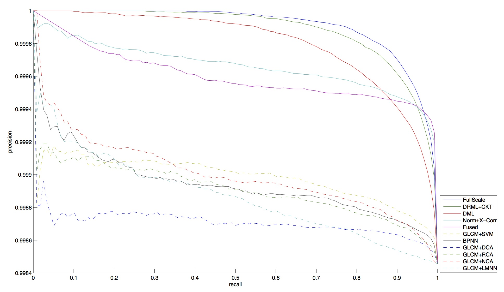

# Deep Residual Metric Learning for Human Re-identification in Video Surveillance-based Affective Computing
[](LICENSE) [](https://github.com/Lmy0217/DRML/pulls)

[中文](README_zh.md)

This project is a novel deep residual metric learning (DRML) method for person re-identification, and this method **combines deep residual networks with metric learning for the first time**.

## Installation
* Operating system: Ubuntu 14.04 LTS, CPU i7-3770 @ 3.40GHz×8, GPU GT 630, Memory 4G
* Dependencies: 
  * [CUDA](https://developer.nvidia.com/cuda-toolkit) and [cuDNN](https://developer.nvidia.com/cudnn) with GPU
  * [Torch](https://github.com/torch/torch7) with packages ([nn](https://github.com/torch/nn), [cunn](https://github.com/torch/cunn), [cutorch](https://github.com/torch/cutorch), [cudnn](https://github.com/soumith/cudnn.torch)) installed by default, as well as some special packages such as [loadcaffe](https://github.com/szagoruyko/loadcaffe) and [matio](https://github.com/soumith/matio-ffi.torch)
  * Matlab (R2014a version) - for some result analysing scripts

## Prerequisites
### getting project
* If you don't need trained models and results, please directly clone this project as

```shell
git clone https://github.com/Lmy0217/DRML.git
cd DRML
```
* If you need trained models and results, please recursively clone this project as

```shell
git clone https://github.com/Lmy0217/DRML.git --recursive
cd DRML
```
The trained results saved in the folder `./ours` and the trained models saved in the folder `./ours/models`.

### datasets
* Download the [CUHK03](http://www.ee.cuhk.edu.hk/~xgwang/CUHK_identification.html) (labeled & detected) dataset, then extract and place the file (cuhk-03.mat) in the folder `./datasets/cuhk03`.
* Download the [CUHK01](http://www.ee.cuhk.edu.hk/~xgwang/CUHK_identification.html) dataset and extract the zip file (CAMPUS.zip) in the folder `./datasets/cuhk01` (now, this folder should contain a folder named 'campus').
* Execute the script `datasets.lua` as

```shell
th datasets.lua
```

### AlexNet model
* Download the [AlexNet](http://dl.caffe.berkeleyvision.org/bvlc_alexnet.caffemodel) pre-trained model in the folder `./models`.

## Training and Testing
Ours method are organized into two steps:

1. Pre-training feature extracting part on CUHK03.
2. Fine-tuning feature extracting part and metric learning part on CUHK01.

### pre-training
* Modify (whether or not using residual) and run `cnn.lua` to create ours pre-training model `./results/cnn_0.t7` as

```shell
th cnn.lua
```
* Run `pre-training.lua` with current epoch model saved as `./results/pre-training/cnn_current.t7` and all losses saved in `./results/pre-training.log`, execute it as

```shell
th pre-training.lua
```
* Modify (which model will be tested) and run `test-verify.lua` (verifying) as

```shell
th test-verify.lua
```

different convolutional models accuracy on CUHK03 testset

| convolutional model             | accuracy   |
|---------------------------------|------------|
| 3 conv. + 2 pool.               | 61.12%     |
| AlexNet (DML)                   | 76.61%     |
| **AlexNet + Full Conv.** (DRML) | **77.02%** |

AlexNet + Full Conv. could get higher accuracy with more time.

### fine-tuning
* Modify (set your pre-trained model and whether or not using residual) and run `drml.lua` to create ours fine-tuning model `./results/drml_0.t7` as

```shell
th drml.lua
```
* Run `fine-tuning.lua` with current epoch model saved as `./results/fine-tuning/drml_current.t7` (save model `./results/fine-tuning/drml_[epoch].t7` every 10 epochs) and all losses saved in `./results/fine-tuning.log`, execute it as

```shell
th fine-tuning.lua
```
* Modify (which model will be tested) and run `test-identify.lua` (identifying) to predict similarities (distances) `./results/prediction.txt` (including two columns, the first column is predicted similarities (distances) and the second column represent positive pair (value 1) or negative pair (value -1)), run `prec.m` to get P-R curves, execute it as

```shell
th test-identify.lua
matlab14a  -r "run('prec.m'); exit;"
```

different models P-R curves on CUHK01 testset



DRML could get higher P-R curve with more time.

## Citation
If you find this project useful in your research, please consider citing:
```
@article{luo2017deep,
  title={Deep Residual Metric Learning for Human Re-identification in Video Surveillance-based Affective Computing},
  author={Mingyuan Luo, Wei Huang, Peng Zhang, Jing Li, Min Wan, Huijun Ding, Guang Chen},
  journal={Affective Social Multimedia Computing (ASMMC)},
  year={2017}
}
```

## License
[MIT License](LICENSE)